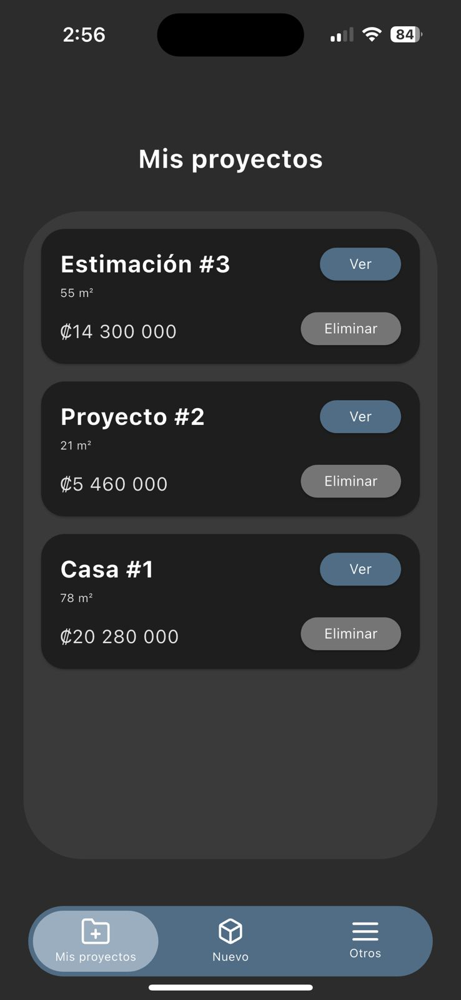
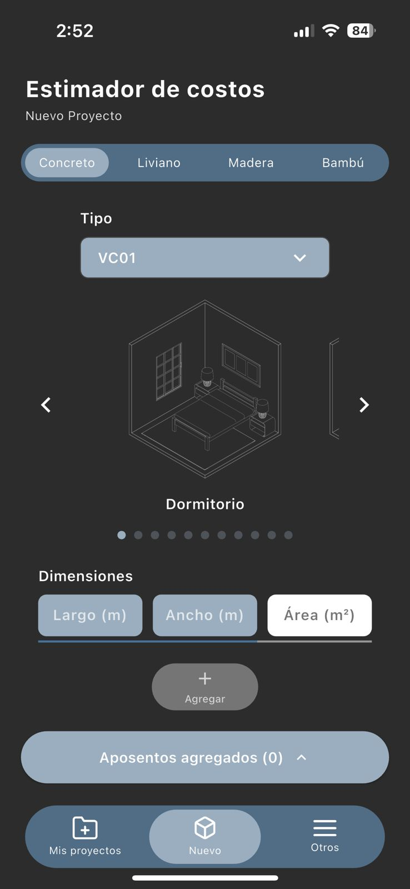
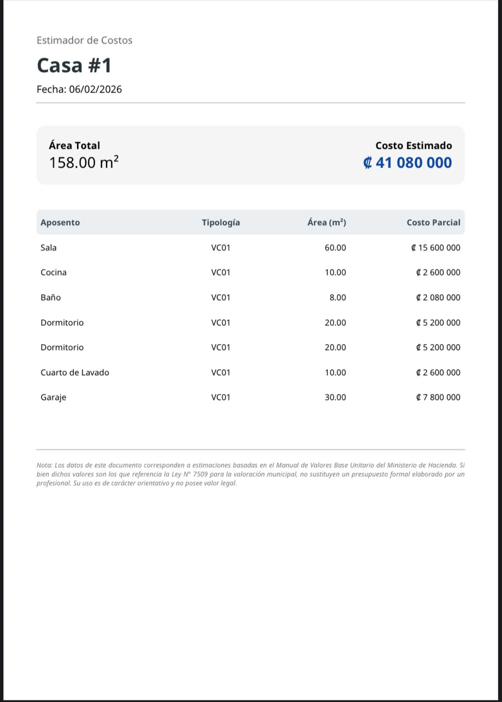

<div align="center">
  <br>
  

  <br>

  <h1>Estimador de Costos de Construcción CR</h1>

  <p>
    
    &nbsp;
    
    &nbsp;
    
  </p>

  <p>
    <a href="TU_ENLACE_DE_APP_STORE_AQUI">
      
    </a>
    &nbsp;&nbsp;&nbsp; <a href="TU_ENLACE_DE_PLAY_STORE_AQUI">
      
    </a>
  </p>
</div>

<br> ESTACO CR (Estimador de Costos de Construcción)


<p align="left">
  <a href="https://apps.apple.com/cr/app/estaco-cr/id6755981891">
    
  </a>
  &nbsp;&nbsp;&nbsp; <a href="https://play.google.com/store/apps/details?id=com.tfgapp.estacocr">
    
  </a>
</p>

**Estimador de Costos de Construcción CR** es una solución móvil profesional desarrollada para la valoración preliminar de obras civiles en Costa Rica. Automatiza los cálculos basados en el **Manual de Valores Base Unitario por Tipología** del Ministerio de Hacienda.

---

## 🌟 Características Principales

* **Cálculo por Tipologías:** Soporte completo para sistemas constructivos de Concreto (VC), Liviano (VS), Madera (VM) y Bambú (VB).
* **Gestión de Proyectos:** CRUD completo con persistencia local mediante `shared_preferences`.
* **Generación de Reportes PDF:** Exportación de estimaciones profesionales con desglose detallado de áreas y costos parciales.
* **Interfaz Moderna:** Modo oscuro optimizado con una experiencia de usuario (UX) fluida y reactiva.
* **Recursos Educativos:** Guía integrada sobre normativa vigente, impuestos y sistemas de contratación.

---

## 🛠️ Arquitectura y Stack Técnico

El proyecto sigue principios de **Clean Code** y una estructura desacoplada para garantizar escalabilidad:

| Capa | Responsabilidad |
| :--- | :--- |
| **Modelos** | Clases inmutables con serialización JSON para persistencia. |
| **Servicios** | Lógica de negocio, almacenamiento y motor de generación PDF. |
| **Interfaz (UI)** | Widgets personalizados y navegación optimizada. |
| **Temas** | Gestión centralizada de estilos, colores y tipografía (Montserrat). |

---

## 🚀 Reto Técnico Destacado: Soporte Tipográfico ₡

Un desafío crítico fue la exportación a PDF manteniendo la fidelidad del símbolo del **Colón (₡)**. Se implementó una carga asíncrona de fuentes (Noto Sans) en el motor de renderizado para garantizar que los reportes sean legibles y profesionales en cualquier dispositivo.

---

## 📂 Estructura del Proyecto

```text
lib/
 ├── data/      # Base de datos de tipologías y especificaciones.
 ├── models/    # Definición de objetos (Project, Aposento, Typology).
 ├── screens/   # Vistas de la aplicación.
 ├── services/  # Lógica de persistencia y reportes.
 ├── theme/     # Estilos globales y paleta de colores.
 ├── widgets/   # Componentes de UI reutilizables.
 └── main.dart  # Punto de entrada.

```

---

## 📸 Capturas de Pantalla

| Dashboard de Proyectos | Editor de Estimación | Reporte en PDF |
| :---: | :---: | :---: |
|  |  |  |

> **Nota:** *La interfaz utiliza el tema oscuro optimizado para reducir la fatiga visual.*

---

## 🚀 Instalación y Uso

1. **Clonar el repositorio:**
```
git clone https://github.com/jvalverde-dev/estimador-costos-flutter.git

```


2. **Instalar dependencias:**
```
flutter pub get

```


3. **Ejecutar la aplicación:**
```
flutter run

```


---

## 👷 Desarrollado por

**Justin Valverde | Desarrollo Web y Soluciones**
Estudiante de Ingeniería en Software enfocado en crear herramientas que simplifiquen procesos técnicos complejos.

---

## 📝 Nota Legal

Esta herramienta tiene carácter **orientativo**. Las estimaciones se basan en valores de referencia y no sustituyen el presupuesto formal de un profesional colegiado.
